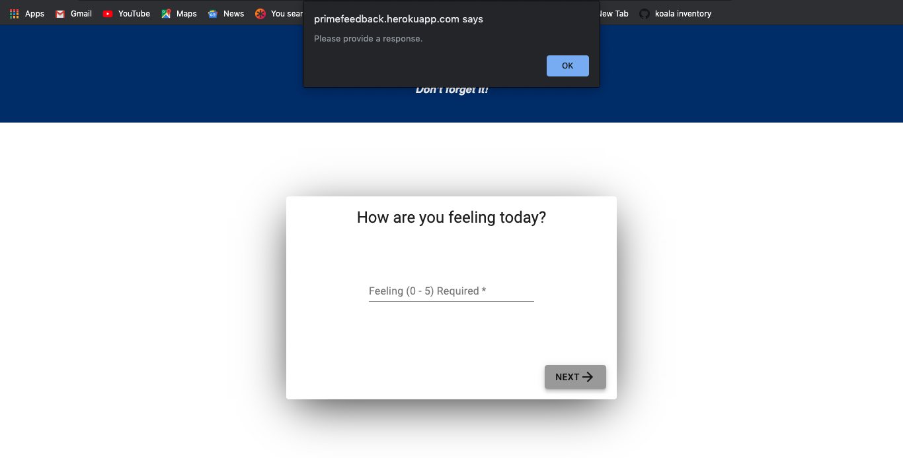
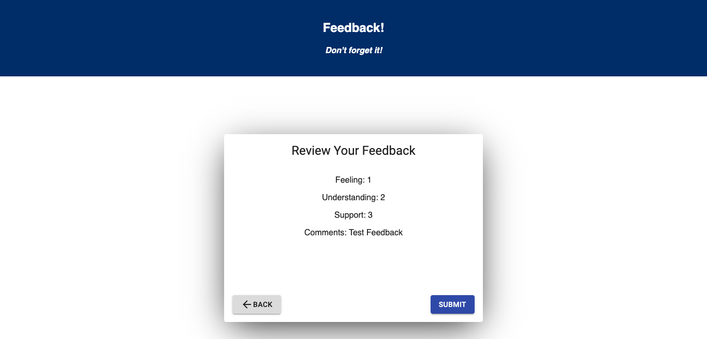
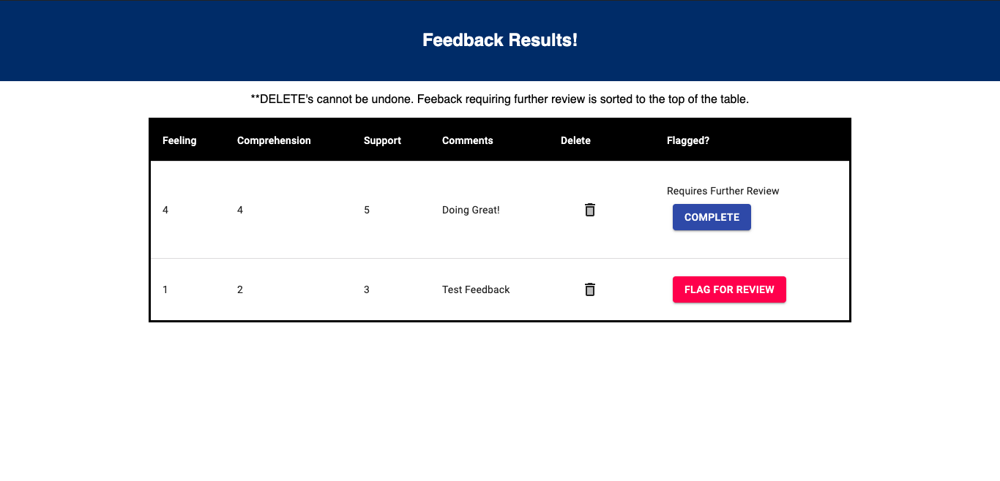

# Feedback Application

## Description

_Duration: 2 Days_

This application is an example feedback form to gather users current feelings when learning in a class. There is also an admin page onl accessible to approved users for review of all feedback entries submitted to a database. This project developed skills with react, redux, and material-ui and handling local, as well as Redux, state and props. The ability to work with and query a database was also tested in developing this application.

To see the fully functional site, please visit: [DEPLOYED VERSION OF APP](https://primefeedback.herokuapp.com/#/0)

## Screen Shot

### Prerequisites

- [Node.js](https://nodejs.org/en/)
- [Postgres](https://www.postgresql.org/download/)

## Installation

1. Create a database named `prime_feedback`,
2. The queries in the `data.sql` file are set up to create all the necessary tables and populate the needed data to allow the application to run correctly. The project is built on [Postgres](https://www.postgresql.org/download/), so you will need to make sure to have that installed. We recommend using Postico to run those queries as that was used to create the queries, 
3. Open up your editor of choice and run an `npm install`
4. Run `npm run server` in your terminal
5. Run `npm run client` in your terminal
6. The `npm run client` command will open up a new browser tab for you!

- Alternatively, visit the deployed version on Heroku to interact with the standalone application.

## Usage
How does someone use this application? Tell a user story here.

1. Provide feedback as prompted on each page.
2. type '/admin' into the url to access the restricted admin page.
3. To flag a feedback for review click the flag button.
4. To mark flagged feedback as complete, click the complete button.
5. TO delete feedback permanently from the database, click the delete icon.

## Built With

- React
- Redux
- Material-UI
- Javascript

## Acknowledgement
Thanks to [Prime Digital Academy](www.primeacademy.io) who equipped and helped me to make this application a reality.
Thanks to the Dijkstra cohort for learning the material with me and helping me through the whole process.
Thanks to all the awesome instructors for doing a great job teaching the material.

## Support
If you have suggestions or issues, please email me at [zbattaglia3@gmail.com](www.google.com)
